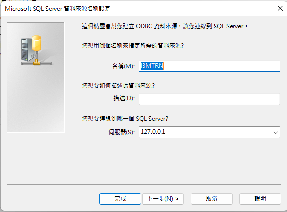

sqlg  repository for tutorial

[](https://hub.docker.com/r/saastoolset/sqlg-airflow/tags?ordering=last_updated)


[](https://hub.docker.com/r/saastoolset/sqlg-airflow/)
[]()
[]()

This repository contains **Dockerfile** of [apache-airflow](https://github.com/apache/incubator-airflow) for [Docker](https://www.docker.com/)'s [automated build](https://registry.hub.docker.com/u/saastoolset/sqlg-airflow/) published to the public [Docker Hub Registry](https://registry.hub.docker.com/).


- [1. The proposed environment](#1-the-proposed-environment)
- [2. Envirioment preparation](#2-envirioment-preparation)
  - [2.1. Create github repo by fork](#21-create-github-repo-by-fork)
  - [2.2. Pull db image](#22-pull-db-image)
- [3. Database install and run script](#3-database-install-and-run-script)
  - [3.1 Start container](#31-start-container)
    - [3.1.1. Windows](#311-windows)
    - [3.1.2. Linux](#312-linux)
    - [3.1.3. Mac](#313-mac)
  - [3.2 Connect by sql client](#32-connect-by-sql-client)
  - [3.3 Build SQLEXT](#33-build-sqlext)
    - [3.3.1 Create database and Sehema from sql client tool](#331-create-database-and-sehema-from-sql-client-tool)
    - [3.3.2 Install SQLEXT from sql client tool](#332-install-sqlext-from-sql-client-tool)
  - [3.4 Install tutorial](#34-install-tutorial)
    - [3.4.1 Build training data](#341-build-training-data)
    - [3.4.2 Build studend list](#342-build-studend-list)
  - [3.5 Install SQLG and ODBC](#35-install-sqlg-and-odbc)
    - [3.5.1 Install SQLG](#351-install-sqlg)
    - [3.5.2 config ODBC](#352-config-odbc)
    - [3.5.3 Create or Alter [TRNADM]](#353-create-or-alter-trnadm)
- [4. Conduct Training](#4-conduct-training)
  - [4.1 For instructor](#41-for-instructor)
  - [4.2 For student](#42-for-student)
- [5. SQLG in db to db](#5-sqlg-in-db-to-db)
- [6. SQLG in web application](#6-sqlg-in-web-application)
- [7. SQLG in Data Vault](#7-sqlg-in-data-vault)
- [8. SQLG in dbt](#8-sqlg-in-dbt)
- [9. Wanna help?](#9-wanna-help)
***
# 1. The proposed environment 
Follwing step will assume those tools are installed

- [Docker](https://www.docker.com/products/docker-desktop/) as container tool
- [Visual Code](https://code.visualstudio.com/download) as IDE
- sqlg as ETL transformation tools

# 2. Envirioment preparation

## 2.1. Create github repo by fork

1. [create fork from sqlg-tutor](https://github.com/saastoolset/sqlg-tutor/fork)

2. Clone sqlg-tuto from github
  - Suggest directory as C:\Proj\saastoolset\sqlg-tutor


## 2.2. Pull db image   
. Pull image 

```
    C:> docker pull mcr.microsoft.com/mssql/server
```
  
# 3. Database install and run script


## 3.1 Start container 

### 3.1.1. Windows

. Start by option and open in browser, e.g. tutorial model
    
```
C:> docker run --name mssql-h1 -d -p 1433:1433 -e "MSSQL_SA_PASSWORD=MyPassw0rd" -e "ACCEPT_EULA=Y" mcr.microsoft.com/mssql/server
```

### 3.1.2. Linux
- Start by option and open in browser, e.g. tutorial model    

```
$ docker run --name mssql-h1 -d -p 1433:1433 -e 'MSSQL_SA_PASSWORD=MyPassw0rd' -e 'ACCEPT_EULA=Y' mcr.microsoft.com/mssql/server
```

### 3.1.3. Mac
- Start by option and open in browser, e.g. tutorial model 
  
```
$ docker run --name mssql-h1 -d -p 1433:1433 -e 'MSSQL_SA_PASSWORD=MyPassw0rd' -e 'ACCEPT_EULA=Y' mcr.microsoft.com/mssql/server
```

## 3.2 Connect by sql client
- Use SSMS in MSSQL
  
```
  ServerName: 127.0.0.1
  Authentication: SQL Server Authentication
  Login: sa
  Password: MyPassw0rd
```

## 3.3 Build SQLEXT

  SQLEXT use for ETL date conversion function when call from stored procedure from scheduler.

### 3.3.1 Create database and Sehema from sql client tool
- For tutorial, create DB name as Tutor, schema SQLEXT and TRN are requried
- For implementation project setup, schema will mapping to data zone.

### 3.3.2 Install SQLEXT from sql client tool

- Create schema for all data zone, may create schema.ddl by project
- holiday.ddl, Holiday table for working calendar
- fn_AddBusinessDays.sql, Business day function on working calendar
- etldate.sql, ETL date function for SQLG macro
- sp_drop_if_exists.ddl, Drop if function for MSSQL
  

## 3.4 Install tutorial
- [Tutorial PPT](doc/LI-BDM-Train-v2.1.pptx)
- [Tutorial DI](doc/LI_TRN_DI_v2.1-instructuor.xlsm)

### 3.4.1 Build training data
- Verify by sql client 
- Verify tutorial excel


### 3.4.2 Build studend list
- Collect studend list
- Build studend list

## 3.5 Install SQLG and ODBC
### 3.5.1 Install SQLG
- download and run [addinstall.bat](https://ibm.ent.box.com/folder/167973666600?s=i2a1z26ga114wdq7rnmrjoavp9mx9mfb)

### 3.5.2 config ODBC
- ODBC configuration

  

```
    ServerName: 127.0.0.1
    DSN: IBMTRN
    Database: Tutor
    Login: sa
    Password: MyPassw0rd
```

### 3.5.3 Create or Alter [TRNADM]
- TRNADM use ODBC link to fetch studend progress into Excel
- Report display on [pvtProgress]


# 4. Conduct Training
## 4.1 For instructor
- {STUD_ID}=ODP00
- Demo
- Track [pvtProgress]
- 
## 4.2 For student
- set {STUD_ID}=ODP?? follow instructor's name list
- Perform exercise follow training material
- Feedback issue on channel


# 5. SQLG in db to db

# 6. SQLG in web application

# 7. SQLG in Data Vault

# 8. SQLG in dbt

# 9. Wanna help?

Fork, improve and PR.
